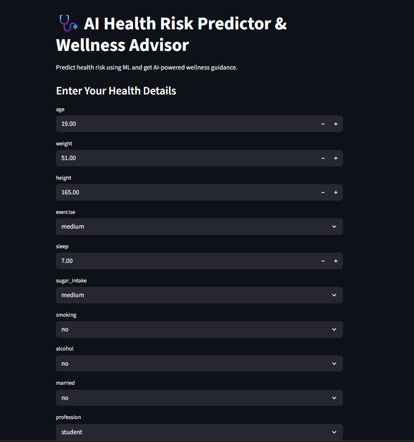
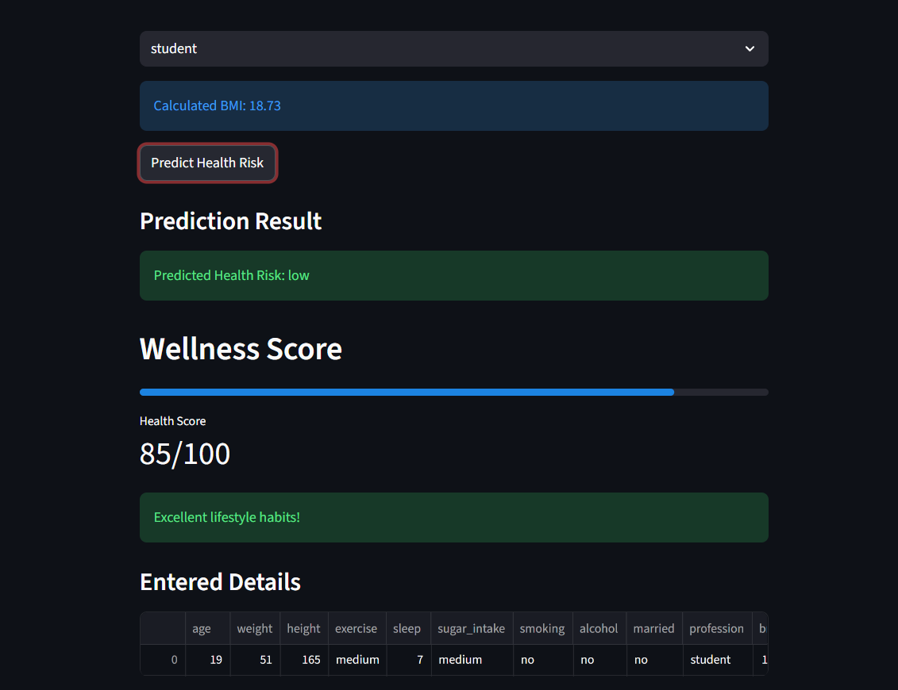
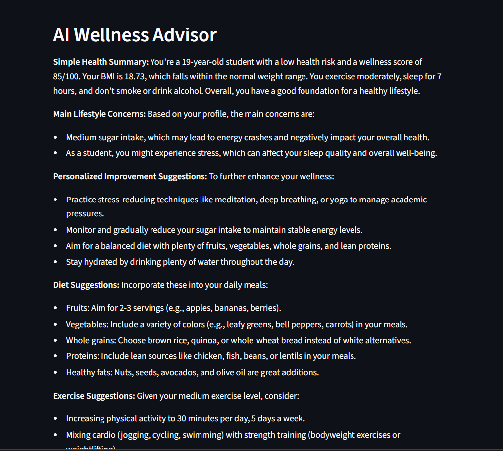
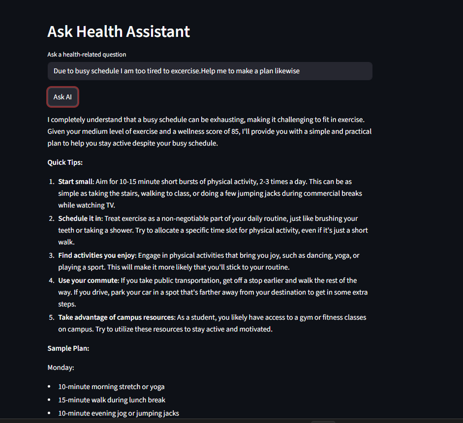

# AI Health Risk Predictor & Wellness Advisor
AI-powered health risk prediction and wellness recommendation system using Machine Learning, Streamlit, and Generative AI.

## Overview
This project predicts health risk levels based on lifestyle and health-related factors using Machine Learning. It also provides wellness recommendations and AI-powered guidance through an interactive Streamlit application.

## Features
- Health Risk Prediction
- BMI Calculation
- Wellness Score Generation
- AI-powered Wellness Advisor
- Interactive Health Chatbot

## Tech Stack
- Python
- Pandas
- NumPy
- Scikit-Learn
- Streamlit
- Groq API

## Machine Learning Model
- Decision Tree Classifier

## Dataset
Lifestyle_and_Health_Risk_Prediction_Synthetic_Dataset.csv

This project uses a synthetic dataset for educational and machine learning experimentation purposes.


## How to Run

```bash
pip install -r requirements.txt
streamlit run app.py
```
## Screenshots

### Dashboard


### Wellness Score


### AI Wellness Advisor


### Health Assistant

